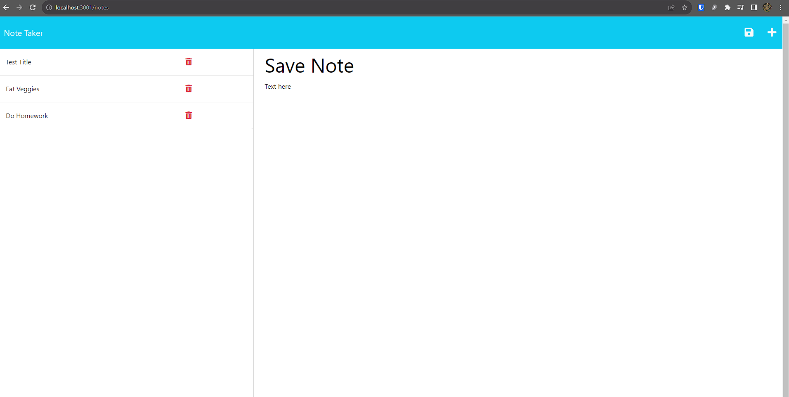

# Note Taker
## Description

This is a Note Taker designed by Yoon-Jae Kim after cloning from starter code provided by EdX. The purpose of this program is to solidify Express.js concepts learned from Module 11 of the NW University Coding Bootcamp. 

After installing the required node dependencies, the app will run on a local Express server on port 3001. The app will direct the user to the landing page which is hosted on index.html. Clicking the button on the center will redirect the user to the UI itself. This is hosted on notes.html.

On page load, the left column will display all saved notes stored in db.json in the db folder. The user can update this file by saving a note with a title and text. This will dynamically update the list of notes on the left as well as update the db.json file. Users can also click the notes on the left to view the text and title on the right. 

The backend of the app was designed by Yoon-Jae Kim while the front end was designed by NW Coding Bootcamp. The app should show Modular Routing and also uses helper js files, uuid and fsUtils to allow for dynamic id gen and file reading and appending, respectively.

Methods used here were learned from NW Coding Bootcamp.

## Table of Contents
- [Installation](#installation)
- [Usage](#usage)
- [Credits](#credits)
- [License](#license)
- [How to Contribute](#how-to-contribute)
- [Tests](#tests)

## Installation
Clone the repo into your local machine, then run 'npm i', then run 'npm start'. Make sure that node is already installed before running the command in your CLI. You may then make api calls by either opening the local host URL in your browser or by inputting calls using Postman, Insomnia or any other similar software.

## Usage
This project can be used by anyone looking to streamline their README creation process.

## Credits
### Github
[Yoonbacca](https://github.com/Yoonbacca)
### Email
[yoonjaekim3@gmail.com](yoonjaekim3@gmail.com)

## License
None

## How to Contribute
This is a solo project and does not require contributions at this time.

  